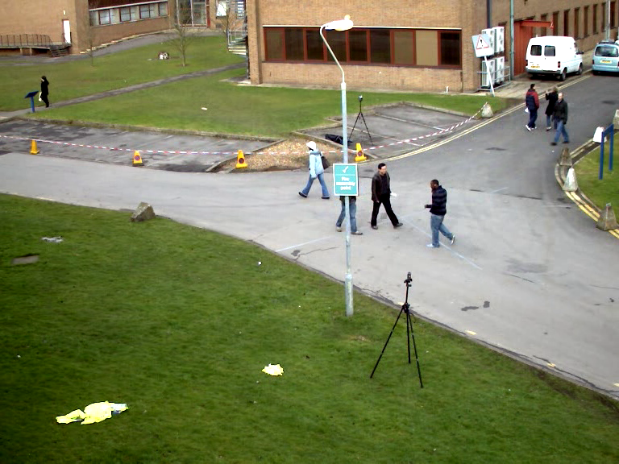
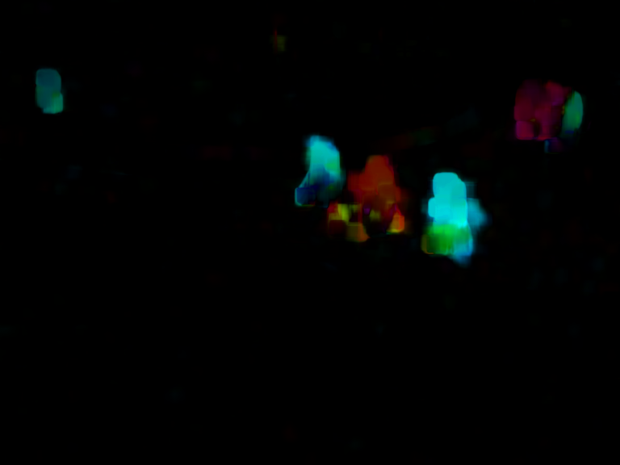

# 视频光流检测
✏️ ⛳️👍

**More Detail, please check the blog of zhihu as below**

✈️ ✈️ ✈️ [OpenCV视频分析-光流分析](https://zhuanlan.zhihu.com/p/69999853)

## 概述

✔️ 光流是由对象或相机的移动引起的两个连续帧之间的图像对象的明显运动的模式.它是2D矢量场，其中每个矢量是位移矢量，表示从第一帧到第二帧的点的移动。

如下图所示，是一个球在连续的5帧图像中的运动,箭头显示其位移矢量.


**光流有很多应用场景如下：**

- 运动恢复结构
- 视频压缩
- 视频防抖动等

**光流法的工作原理基于如下假设：**

- 连续的两帧图像之间，**目标像素灰度值不变**。
- 相邻的像素之间有**相似的运动**。


✔️ 为了求解未知的u, v，采用Lucas-Kanada 方法解决,这个算法最早是有Bruce D. Lucas and Takeo Kanade两位作者提出来的，所以又被称为KLT。

KLT算法工作有三个假设前提条件：
- 亮度恒定
- 短距离移动
- 空间一致性

## 函数

✔️ Opencv中使用`cv2.calcOpticalFlowPyrLK()`函数计算一个稀疏特征集的光流，使用金字塔中的迭代 Lucas-Kanade 方法。
```python
nextPts,status,err = cv2.calcOpticalFlowPyrLK(prevImg,   #上一帧图片
                                              nextImg,   #当前帧图片
                                              prevPts,   #上一帧找到的特征点向量
                                              nextPts    #与返回值中的nextPtrs相同
                                              [, status[, err[, winSize
                                              [, maxLevel[, criteria
                                              [, flags[, minEigThreshold]]]]]]])
```
>输入值：

- prevImg--> 上一帧图片;
- nextImg--> 当前帧图片;
- prevPts--> 上一帧找到的特征点向量;
- nextPts--> 与返回值中的nextPtrs相同;
- status--> 与返回的status相同;
- err--> 与返回的err相同;
- winSize--> 在计算局部连续运动的窗口尺寸（在图像金字塔中）,default=Size(21, 21);
- maxLevel--> 图像金字塔层数，0表示不使用金字塔, default=3;
- criteria--> 寻找光流迭代终止的条件;
- flags--> 有两个宏，表示两种计算方法，分别是OPTFLOW_USE_INITIAL_FLOW表示使用估计值作为寻找到的初始光流，OPTFLOW_LK_GET_MIN_EIGENVALS表示使用最小特征值作为误差测量,default=0;
- minEigThreshold-->  该算法计算光流方程的2×2规范化矩阵的最小特征值，除以窗口中的像素数; 如果此值小于minEigThreshold，则会过滤掉相应的功能并且不会处理该光流，因此它允许删除坏点并获得性能提升, default=1e-4.

>返回值：

- nextPtrs--> 输出一个二维点的向量，这个向量可以是用来作为光流算法的输入特征点，也是光流算法在当前帧找到特征点的新位置（浮点数）;
- status--> 标志，在当前帧当中发现的特征点标志status==1，否则为0;
- err--> 向量中的每个特征对应的错误率.

**实现原理：**
- 在第一帧图像中检测Shi-Tomasi角点，
- 使用LK算法来迭代的跟踪这些特征点。迭代的方式就是不断向cv2.calcOpticalFlowPyrLK()中传入上一帧图片的特征点以及当前帧的图片。
- 函数会返回当前帧的点，这些点带有状态1或者0，如果在当前帧找到了上一帧中的点，那么这个点的状态就是1，否则就是0。

**实现流程：**

- 加载视频。
- 调用`cv2.GoodFeaturesToTrack` 函数寻找兴趣点（关键点）。
- 调用`cv2.CalcOpticalFlowPyrLK` 函数计算出两帧图像中兴趣点的移动情况。
- 删除未移动的兴趣点。
- 在两次移动的点之间绘制一条线段。

## 示例代码

**1. 删除静止点的光流分析：**
[Python code](../code_085/opencv_085_flow.py)


**2. 反向检测的光流分析：**
[Python code](../code_085/opencv_085.py)


# 稠密光流

## 概述
✔️ Lucas-Kanade方法计算稀疏特征集的光流，OpenCV提供了另一种算法来查找密集的光流，它计算帧中所有点的光流。它基于Gunner Farneback于2003年的《Two-Frame Motion Estimation Based on Polynomial Expansion》。

## 函数
✔️ 我们可以通过Opencv的函数`cv2.calcOpticalFlowFarneback`寻找稠密光流，我们得到的一个两个通道的向量(u,v)。得到的该向量的大小和方向。用不同的颜色编码来使其可视化。

✔️ 方向与Hue值相关，大小与Value值相关。

```bash
flow=cv.calcOpticalFlowFarneback(
        prev,
        next, flow,
        pyr_scale, levels, winsize,
        iterations, poly_n, poly_sigma, flags)
```

>输入
- prev--> 前一帧图片
- next--> 下一帧图片，格式与prev相同
- flow--> 与返回值相同，得到一个CV_32FC2格式的光流图
- pyr_scale--> 构建图像金字塔尺度
- levels--> 图像金字塔层数
- winsize--> 窗口尺寸，值越大探测高速运动的物体越容易，但是越模糊，同时对噪声的容错性越强
- iterations--> 对每层金字塔的迭代次数
- poly_n--> 每个像素中找到多项式展开的邻域像素的大小。n越大越光滑，也越稳定
- poly_sigma--> 高斯标准差，用来平滑倒数，n越大，sigma应该适当增加
- flags--> 光流的方式，有OPTFLOW_USE_INITIAL_FLOW 和OPTFLOW_FARNEBACK_GAUSSIAN 两种
-
> 输出
- 一个两通道的光流向量，实际上是每个点的像素位移值

## 示例代码
[Python code](../code_086/opencv_086.py)



# 参考
👍👍👍- [机器视觉 OpenCV—python目标跟踪（光流）](https://blog.csdn.net/wsp_1138886114/article/details/84400392)

👍👍👍- [opencv python 光流法](https://segmentfault.com/a/1190000015777243)

👍👍👍- [OpenCV Tutorial 官网](https://docs.opencv.org/4.0.0-alpha/d6/d00/tutorial_py_root.html)
