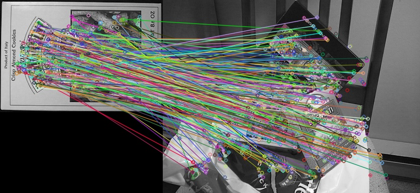

### AKAZE特征与描述子

AKAZE特征提取算法是局部特征描述子算法，可以看成是SIFT算法的改进、采用非线性扩散滤波迭代来提取与构建尺度空间、采用与SIFT类似的方法寻找特征点、在描述子生成阶段采用ORB类似的方法生成描述子，但是描述子比ORB多了旋转不变性特征。

ORB采用LDB方法，AKAZE采用 M-LDB。

**代码：**

```python
import cv2 as cv

box = cv.imread("box.png");
box_in_sence = cv.imread("box_in_scene.png");
cv.imshow("box", box)
cv.imshow("box_in_sence", box_in_sence)

# 创建AKAZE特征检测器
akaze = cv.AKAZE_create()
kp1, des1 = akaze.detectAndCompute(box,None)
kp2, des2 = akaze.detectAndCompute(box_in_sence,None)

# 暴力匹配
bf = cv.BFMatcher(cv.NORM_HAMMING, crossCheck=True)
matches = bf.match(des1,des2)

# 绘制匹配
result = cv.drawMatches(box, kp1, box_in_sence, kp2, matches, None)
cv.imshow("orb-match", result)
cv.imwrite('orb-match.jpg', result)
cv.waitKey(0)
cv.destroyAllWindows()
```


