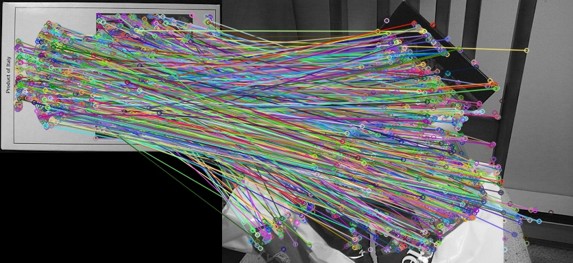

### Brisk特征提取与描述子匹配

BRISK(Binary robust invariant scalable keypoints)是一种基于尺度空间不变性类似ORB特征描述子的特征提取算法。BRISK主要步骤可以分为如下两步：
1.	构建尺度空间金字塔实现关键点定位
2.	根据关键点生成描述子

**代码：**

```python
import cv2 as cv

box = cv.imread("box.png");
box_in_sence = cv.imread("box_in_scene.png");
cv.imshow("box", box)
cv.imshow("box_in_sence", box_in_sence)

# 创建BRISK特征检测器
brisk = cv.BRISK_create()
kp1, des1 = brisk.detectAndCompute(box,None)
kp2, des2 = brisk.detectAndCompute(box_in_sence,None)

# 暴力匹配
bf = cv.BFMatcher(cv.NORM_HAMMING, crossCheck=True)
matches = bf.match(des1,des2)

# 绘制匹配
result = cv.drawMatches(box, kp1, box_in_sence, kp2, matches, None)
cv.imshow("orb-match", result)
cv.imwrite('orb-match.jpg', result)
cv.waitKey(0)
cv.destroyAllWindows()
```


