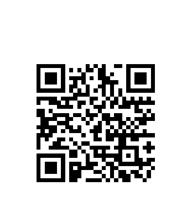
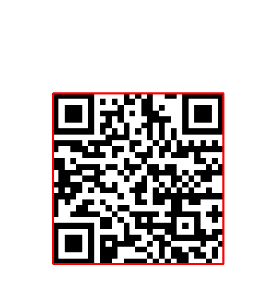
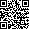

# 二维码检测和识别

## 概述
根据Opencv的描述，OpenCV3.4.4以上版本支持二维码检测和识别！

## 函数

Opencv在对象检测模块中 `QRCodeDetector` 有两个相关API分别实现二维码检测与二维码解析。

1. 检测API
```
points = QRCodeDetector.detect(img)
```
其中：
- img为输入图像，灰度或者彩色图像；
- points输出得到的二维码四个点的坐标信息；

2. 识别API
```
straight_qrcode = QRCodeDetector.decode(img, points)
```
其中：
- img为输入图像，灰度或者彩色图像；
- points是二维码ROI最小外接矩形顶点坐标；
- straight_qrcode输出的是二维码区域ROI图像信息
返回的二维码utf-8字符串；

3. 结合检测识别的API
```
points,straight_qrcode = QRCodeDetector.detectAndDecode(img)
```
其中：
- img为输入图像，灰度或者彩色图像；
- points输出二维码ROI最小外接矩形顶点坐标；
- straight_qrcode输出的是二维码区域ROI图像信息
返回的二维码utf-8字符串；

## 代码

整体检测识别的代码如下：
```python
import cv2
import numpy as np

# 读取二维码
src = cv2.imread("qrcode.png")
gray = cv2.cvtColor(src, cv2.COLOR_BGR2GRAY)
# 设置检测器
qrcoder = cv2.QRCodeDetector()
# 检测识别二维码
codeinfo, points, straight_qrcode = qrcoder.detectAndDecode(gray)
result = np.copy(src)
cv2.drawContours(result, [np.int32(points)], 0, (0, 0, 255), 2)
# 输出识别二维码的信息
print("qrcode information is : \n%s"% codeinfo)
# 显示图片
cv2.imshow("result", result)
cv2.imshow("qrcode roi", np.uint8(straight_qrcode))
cv2.waitKey(0)
cv2.destroyAllWindows()
```
输出：
```
qrcode information is :
Hello, this is Jimmy, thanks for your little star~
```
原图：



检测：



ROI图：


