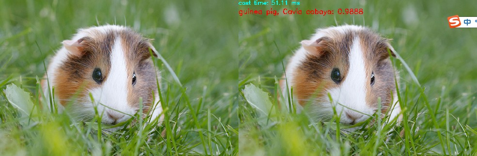

## DNN实现图像分类

### 概述

 ✔️ 我们使用ImageNet数据集支持1000分类的GoogleNet网络模型， 结合opencv实现图像分类标签预测。

>label标签是在一个单独的文本文件中读取。

读取模型的API：
```python
cv2.dnn.readNetFromCaffe(prototxt,
                         caffeModel = String())
```
其中：
- prototxt表示模型的配置文件
- caffeModel表示模型的权重二进制文件

使用模型实现预测的时候，需要读取图像作为输入，网络模型支持的输入数据是四维的输入，所以要把读取到的Mat对象转换为四维张量，OpenCV的提供的API为如下：

```python
cv2.dnn。blobFromImage(
                        image,
                        scalefactor = 1.0,
                        size = Size(),
                        mean = Scalar(),
                        swapRB = false,
                        crop = false,
                        ddepth = CV_32F 
)
```
其中：
- image输入图像
- scalefactor 默认1.0
- size表示网络接受的数据大小
- mean表示训练时数据集的均值
- swapRB 是否互换Red与Blur通道
- crop剪切
- ddepth 数据类型

### 代码
```python
import cv2
import numpy as np

bin_model = "bvlc_googlenet.caffemodel"
protxt = "bvlc_googlenet.prototxt"

# 加载类别
classes = None
with open("classification_classes_ILSVRC2012.txt", 'rt') as f:
    classes = f.read().rstrip('\n').split('\n')

# 加载模型
net = cv2.dnn.readNetFromCaffe(protxt, bin_model)

# 读取输入数据
image = cv2.imread("guinea_pig.jpg")
blob = cv2.dnn.blobFromImage(image, 1.0, (224, 224), (104, 117,123), False, crop=False)
result = np.copy(image)

# 运行模型
net.setInput(blob)
out = net.forward()

# 获取最高分的类别
out = out.flatten()
classId = np.argmax(out)
confidence = out[classId]

# 输出运行时间
t, _ = net.getPerfProfile() #返回值是网络执行推断的时间
label = 'cost time: %.2f ms' % (t * 1000.0 / cv2.getTickFrequency())
cv2.putText(result, label, (0, 20), cv2.FONT_HERSHEY_SIMPLEX, 0.8, (255, 255, 0), 2)

# 显示结果
label = '%s: %.4f' % (classes[classId] if classes else 'Class #%d' % classId, confidence)
cv2.putText(result, label, (0, 60), cv2.FONT_HERSHEY_SIMPLEX, 1, (0, 0, 255), 2)

show_img = np.hstack((image, result))
```
>输出豚鼠的预测结果

