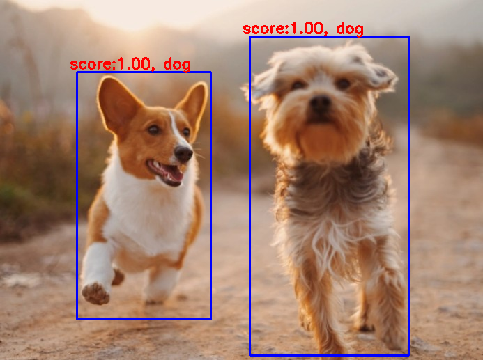

## SSD实现目标检测

✔️ OpenCV的DNN模块支持常见得对象检测模型SSD， 以及Mobile Net-SSD。

✔️ 这里我们用基于Caffe训练好的mobile-net SSD来测试目标检测。

### 单张图片检测

```python
import cv2

model_bin = "../model/ssd/MobileNetSSD_deploy.caffemodel";
config_text = "../model/ssd/MobileNetSSD_deploy.prototxt";
objName = ["background",
			"aeroplane", "bicycle", "bird", "boat",
			"bottle", "bus", "car", "cat", "chair",
			"cow", "diningtable", "dog", "horse",
			"motorbike", "person", "pottedplant",
			"sheep", "sofa", "train", "tvmonitor"];

# 加载模型
net = cv2.dnn.readNetFromCaffe(config_text, model_bin)
image = cv2.imread("dog.jpg")
h = image.shape[0]
w = image.shape[1]

# 获得所有层名称与索引
layerNames = net.getLayerNames()
lastLayerId = net.getLayerId(layerNames[-1])
lastLayer = net.getLayer(lastLayerId)
print(lastLayer.type)

# 加载图片检测
blobImage = cv2.dnn.blobFromImage(image, 0.007843, (300, 300), (127.5, 127.5, 127.5), True, False);
net.setInput(blobImage)
Out = net.forward()
print(Out.shape)
for detection in Out[0,0,:,:]:
    score = float(detection[2])
    objIndex = int(detection[1])
    if score > 0.5:
        left = detection[3]*w
        top = detection[4]*h
        right = detection[5]*w
        bottom = detection[6]*h

        # 绘制
        cv2.rectangle(image, (int(left), int(top)), (int(right), int(bottom)), (255, 0, 0), thickness=2)
        cv2.putText(image, "score:%.2f, %s"%(score, objName[objIndex]),
                (int(left) - 10, int(top) - 5), cv2.FONT_HERSHEY_SIMPLEX, 0.7, (0, 0, 255), 2, 8);

```
>输出


