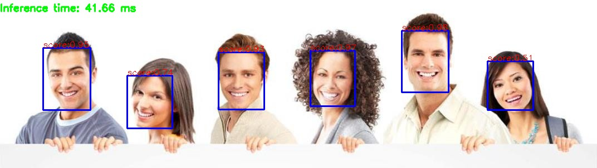

## OpenCV 基于残差网络的人脸检测

### 概述

✔️ ️OpenCV在DNN模块中提供了基于残差SSD网络训练的人脸检测模型，该模型分别提供了tensorflow版本，caffe版本，torch版本模型文件。

✔️ 其中tensorflow版本的模型做了更加进一步的压缩优化，大小只有2MB左右，非常适合移植到移动端使用，实现人脸检测功能，而caffe版本的是fp16的浮点数模型，精准度更好。

✔️ 对比传统人脸检测，同样一张图像，在OpenCV HAAR与LBP级联检测器中必须通过不断调整参数才可以检测出全部人脸，而通过使用该模型，基本在Python语言中基于OpenCV后台的推断，在25毫秒均可以检测出结果，网络支持输入size大小为300x300。

### 代码
```python
import cv2

model_bin = "../model/face_detector/opencv_face_detector_uint8.pb";
config_text = "../model/face_detector/opencv_face_detector.pbtxt";

# load tensorflow model
net = cv2.dnn.readNetFromTensorflow(model_bin, config=config_text)
image = cv2.imread("people.jpg")
h = image.shape[0]
w = image.shape[1]

# 人脸检测
blobImage = cv2.dnn.blobFromImage(image, 1.0, (300, 300), (104.0, 177.0, 123.0), False, False);
net.setInput(blobImage)
Out = net.forward()

t, _ = net.getPerfProfile()
label = 'Inference time: %.2f ms' % (t * 1000.0 / cv2.getTickFrequency())
cv2.putText(image, label, (0, 20), cv2.FONT_HERSHEY_SIMPLEX, 0.6, (0, 255, 0), 2)

# 绘制检测矩形
for detection in Out[0,0,:,:]:
    score = float(detection[2])
    objIndex = int(detection[1])
    if score > 0.5:
        left = detection[3]*w
        top = detection[4]*h
        right = detection[5]*w
        bottom = detection[6]*h

        # 绘制
        cv2.rectangle(image, (int(left), int(top)), (int(right), int(bottom)), (255, 0, 0), thickness=2)
        cv2.putText(image, "score:%.2f"%score, (int(left), int(top)-1), cv2.FONT_HERSHEY_SIMPLEX, 0.5, (0, 0, 255), 1)

cv2.imshow('demo', image)
```
>输出


