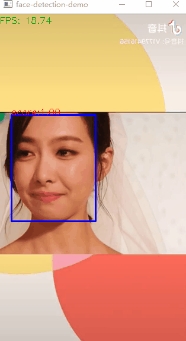

## OpenCV 基于残差网络的视频人脸检测

### 概述

✔️ OpenCV在DNN模块中提供了基于残差SSD网络训练的人脸检测模型，它支持单精度的fp16的检测，准确度更好的Caffe模型加载与使用.


### 代码

✔️ 这里实现了一个基于Caffe Model的视频实时人脸监测模型，基于Python, 在CPU运行，可以达到fps16以上。

```python
import cv2

model_bin = "../model/face_detector/res10_300x300_ssd_iter_140000_fp16.caffemodel";
config_text = "../model/face_detector/deploy.prototxt";

# load caffe model
net = cv2.dnn.readNetFromCaffe(config_text, model_bin)

# set back-end
net.setPreferableBackend(cv2.dnn.DNN_BACKEND_OPENCV)
net.setPreferableTarget(cv2.dnn.DNN_TARGET_CPU)

cap = cv2.VideoCapture(0)
while True:
    ret, image = cap.read()
    image = cv2.flip(image, 1)
    if ret is False:
        break
    # 人脸检测
    h, w = image.shape[:2]
    blobImage = cv2.dnn.blobFromImage(image, 1.0, (300, 300), (104.0, 177.0, 123.0), False, False);
    net.setInput(blobImage)
    cvOut = net.forward()

    # Put efficiency information.
    t, _ = net.getPerfProfile()
    fps = 1000 / (t * 1000.0 / cv2.getTickFrequency())
    label = 'FPS: %.2f' % fps
    cv2.putText(image, label, (0, 15), cv2.FONT_HERSHEY_SIMPLEX, 0.5, (0, 255, 0))

    # 绘制检测矩形
    for detection in cvOut[0,0,:,:]:
        score = float(detection[2])
        objIndex = int(detection[1])
        if score > 0.5:
            left = detection[3]*w
            top = detection[4]*h
            right = detection[5]*w
            bottom = detection[6]*h

            # 绘制
            cv2.rectangle(image, (int(left), int(top)), (int(right), int(bottom)), (255, 0, 0), thickness=2)
            cv2.putText(image, "score:%.2f"%score, (int(left), int(top)), cv2.FONT_HERSHEY_SIMPLEX, 0.5, (0, 0, 255), 1)
    cv2.imshow('face-detection-demo', image)
    c = cv2.waitKey(2)
    if c == 27:
        break
cv2.waitKey(0)
cv2.destroyAllWindows()
```


