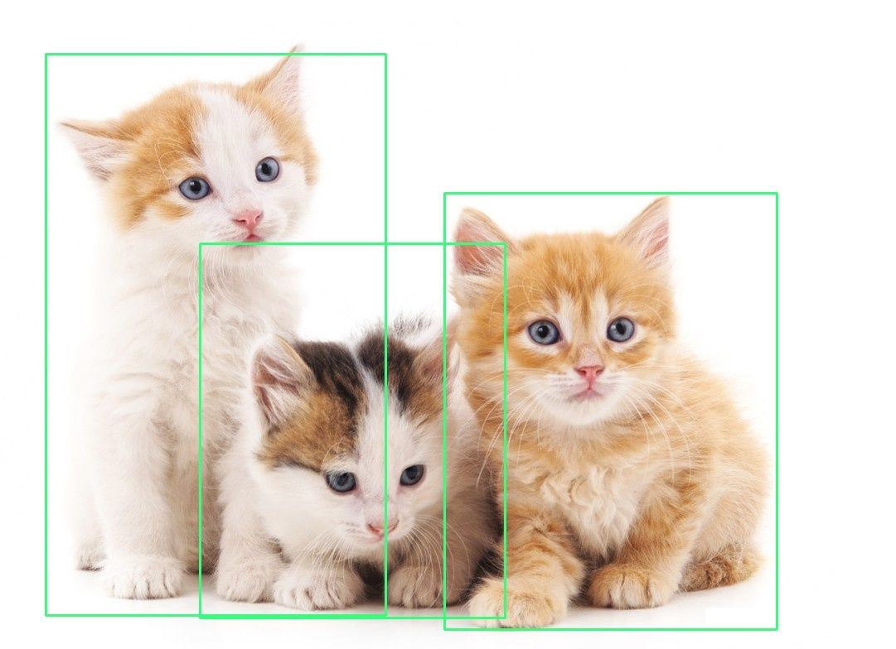
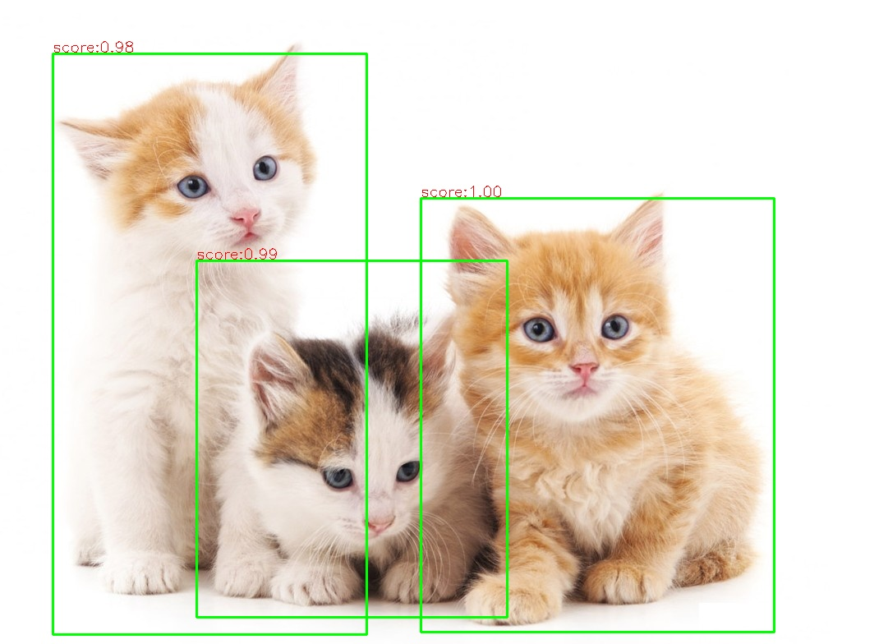

## OpenCV 调用tensorflow

### 概述

✔️OpenCV在DNN模块中支持直接调用tensorflow object detection训练导出的模型使用，支持的模型包括
-	SSD
-	Faster-RCNN
-	Mask-RCNN

✔️ 利用这三种经典的对象检测网络，这样就可以实现从tensorflow模型训练、导出模型、在OpenCV DNN调用模型网络实现自定义对象检测的技术。

✔️ OpenCV3.4.1以上版本支持tensorflow1.11版本以上的对象检测框架(object detetion)模型导出使用，当前支持的模型包括以下：

Model |	Version	| -| -
---|---|---|---
MobileNet-SSD v1|2017_11_17|	[weights](http://download.tensorflow.org/models/object_detection/ssd_mobilenet_v1_coco_2017_11_17.tar.gz)| [config](https://github.com/opencv/opencv_extra/blob/master/testdata/dnn/ssd_mobilenet_v1_coco_2017_11_17.pbtxt)|
MobileNet-SSD v1 PPN|	2018_07_03|	[weights](http://download.tensorflow.org/models/object_detection/ssd_mobilenet_v1_ppn_shared_box_predictor_300x300_coco14_sync_2018_07_03.tar.gz)| [config](https://github.com/opencv/opencv_extra/blob/master/testdata/dnn/ssd_mobilenet_v1_ppn_coco.pbtxt)|
MobileNet-SSD v2|	2018_03_29|	[weights](http://download.tensorflow.org/models/object_detection/ssd_mobilenet_v2_coco_2018_03_29.tar.gz)| [config](https://github.com/opencv/opencv_extra/blob/master/testdata/dnn/ssd_mobilenet_v2_coco_2018_03_29.pbtxt)|
Inception-SSD v2|	2017_11_17|	[weights](http://download.tensorflow.org/models/object_detection/ssd_inception_v2_coco_2017_11_17.tar.gz)| [config](https://github.com/opencv/opencv_extra/blob/master/testdata/dnn/ssd_inception_v2_coco_2017_11_17.pbtxt)|
Faster-RCNN Inception v2|	2018_01_28|	[weights](http://download.tensorflow.org/models/object_detection/faster_rcnn_inception_v2_coco_2018_01_28.tar.gz)| [config](https://github.com/opencv/opencv_extra/blob/master/testdata/dnn/faster_rcnn_inception_v2_coco_2018_01_28.pbtxt)|
Faster-RCNN ResNet-50|	2018_01_28|	[weights](http://download.tensorflow.org/models/object_detection/faster_rcnn_resnet50_coco_2018_01_28.tar.gz)| [config](https://github.com/opencv/opencv_extra/blob/master/testdata/dnn/faster_rcnn_resnet50_coco_2018_01_28.pbtxt)|
Mask-RCNN Inception v2|	2018_01_28|	[weights](http://download.tensorflow.org/models/object_detection/mask_rcnn_inception_v2_coco_2018_01_28.tar.gz)| [config](https://github.com/opencv/opencv_extra/blob/master/testdata/dnn/mask_rcnn_inception_v2_coco_2018_01_28.pbtxt)|

✏️ 使用tensorflow object detection API框架进行迁移学习训练模型，导出预测图之后，然后通过OpenCV3.4.1以上版本提供几个python脚本导出graph配置文件，这样就可以在OpenCV DNN模块中使用tensorflow相关的模型了。

### 使用tensorflow

✔️使用tensorflow预测：
```
import tensorflow as tf
import cv2

# Read the graph.
model_dir = '../faster_rcnn_resnet50_coco_2018_01_28/frozen_inference_graph.pb'
with tf.gfile.FastGFile(model_dir, 'rb') as f:
    graph_def = tf.GraphDef()
    graph_def.ParseFromString(f.read())

with tf.Session() as sess:
    # Restore session
    sess.graph.as_default()
    tf.import_graph_def(graph_def, name='')

    # Read and preprocess an image.
    img = cv2.imread('cat.jpg')
    rows = img.shape[0]
    cols = img.shape[1]
    inp = cv2.resize(img, (300, 300))
    inp = inp[:, :, [2, 1, 0]]  # BGR2RGB

    # Run the model
    out = sess.run([sess.graph.get_tensor_by_name('num_detections:0'),
                    sess.graph.get_tensor_by_name('detection_scores:0'),
                    sess.graph.get_tensor_by_name('detection_boxes:0'),
                    sess.graph.get_tensor_by_name('detection_classes:0')],
                   feed_dict={'image_tensor:0': inp.reshape(1, inp.shape[0], inp.shape[1], 3)})

    # Visualize detected bounding boxes.
    num_detections = int(out[0][0])
    for i in range(num_detections):
        classId = int(out[3][0][i])
        score = float(out[1][0][i])
        bbox = [float(v) for v in out[2][0][i]]
        if score > 0.8:
            x = bbox[1] * cols
            y = bbox[0] * rows
            right = bbox[3] * cols
            bottom = bbox[2] * rows
            cv2.rectangle(img, (int(x), int(y)), (int(right), int(bottom)), (125, 255, 51), thickness=2)
```



### 调用tensorflow

✔️根据tensorflow中迁移学习或者下载预训练模型不同，OpenCV DNN 模块提供如下可以使用脚本生成对应的模型配置文件

```
tf_text_graph_ssd.py

tf_text_graph_faster_rcnn.py

tf_text_graph_mask_rcnn.py
```
✔️这是因为OpenCV DNN需要根据text版本的模型描述文件来解析tensorflow的pb文件，实现网络模型加载。

✔️对检测模型，生成模型描述文件运行以下命令行：
```
python tf_text_graph_ssd.py 

--input /path/to/model.pb 

--config /path/to/example.config 

--output /path/to/graph.pbtxt
```

✔️采用faster_res50目标检测模型生成pbtxt的输出结果：

```
python tf_text_graph_faster_rcnn.py \
--input faster_rcnn_resnet50_coco_2018_01_28/frozen_inference_graph.pb \
--output faster_rcnn_resnet50_coco_2018_01_28/graph.pbtxt \
--config faster_rcnn_resnet50_coco_2018_01_28/pipeline.config

Number of classes: 90
Scales:            [0.25, 0.5, 1.0, 2.0]
Aspect ratios:     [0.5, 1.0, 2.0]
Width stride:      16.000000
Height stride:     16.000000
Features stride:   16.000000
```
✔️opencv调用tensorflow预测目标：
```python
import cv2

inference_pb = "../faster_rcnn_resnet50_coco_2018_01_28/frozen_inference_graph.pb";
graph_text = "../faster_rcnn_resnet50_coco_2018_01_28/graph.pbtxt";

# load tensorflow model
net = cv2.dnn.readNetFromTensorflow(inference_pb, graph_text)
image = cv2.imread("cat.jpg")
h = image.shape[0]
w = image.shape[1]

# 检测
net.setInput(cv2.dnn.blobFromImage(image, size=(300, 300), swapRB=True, crop=False))
cvOut = net.forward()
for detection in cvOut[0,0,:,:]:
    score = float(detection[2])
    if score > 0.5:
        left = detection[3]*w
        top = detection[4]*h
        right = detection[5]*w
        bottom = detection[6]*h

        # 绘制
        cv2.rectangle(image, (int(left), int(top)), (int(right), int(bottom)), (0, 255, 0), thickness=2)
        cv2.putText(image, "score:%.2f"%score, (int(left), int(top)-2), cv2.FONT_HERSHEY_SIMPLEX, 0.6, (0, 0, 255), 1)
```

