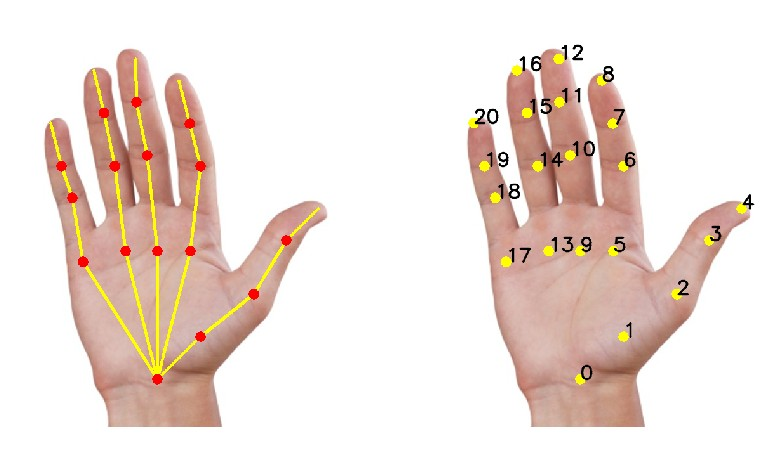

## OpenCV基于OpenPose的手部关键点检测

## 概述

✔️ 手部关键点检测，旨在找出给定图片中手指上的关节点及指尖关节点, 其中手部关键点检测的应用场景主要包括：

手势识别
手语识别与理解
手部的行为识别
✔️ Opencv的DNN手部识别主要基于 CMU Perceptual Computing Lab 开源的手部关键点检测模型OpenPose。

手部关键点检测器的实现主要是基于论文：Hand Keypoint Detection in Single Images using Multiview Bootstrapping - CVPR2017

✏️ 论文中，首先采用少量标注的人手部关键点图像数据集，训练类似于人体姿态关键点所使用的CPM - Convolutional Pose Machines 网络，以得到手部关键点的粗略估计. 采用了 31个 HD 高清摄像头从不同的视角对人手部进行拍摄。然后，将拍摄图像送入手部关键点检测器，以初步得到许多粗略的关键点检测结果。一旦有了同一手部的不同视角的关键点，则构建关键点测量(Keypoint triangulation)，以得到关键点的3D位置。关键点的3D位置被从3D重新投影到每一幅不同视角的 2D 图片，并采用2D图像和关键点，进一步训练网络，以鲁棒的预测手部关键点位置，这对于关键点难以预测的图片而言是尤其重要的。采用这种方式，通过少量几次迭代，即可得到较为准确的手部关键点检测器.

⛳ 总之，关键点检测器和多视角图像(multi-view images) 一起构建了较为准确的手部关键点检测模型. 采用的检测网络类似于人体关键点中所用的网络结构. 进度提升的主要因素是采用了多视角图片标注图片数据集.

✔️ 手部关键点检测模型共输出 22 个关键点，其中包括手部的 21 个点，第 22 个点表示背景. 如图：

