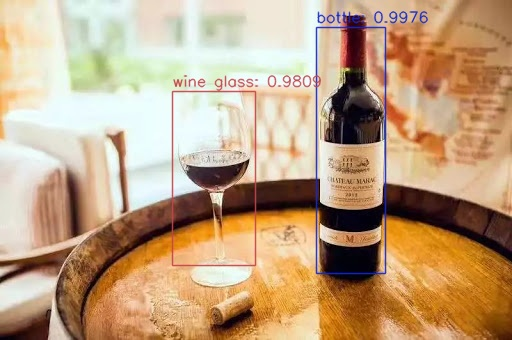
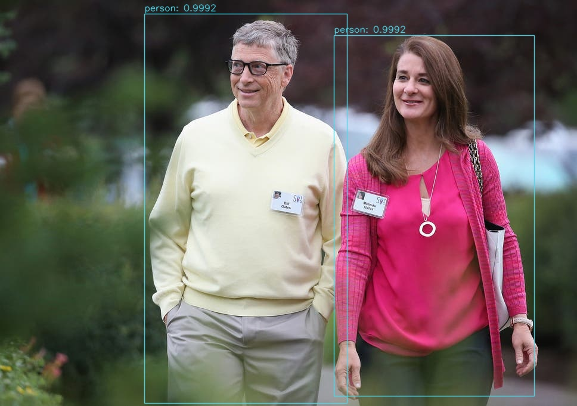

## OpenCV 调用 YOLO 

首先导入相应的包同时设置所需要的参数：

```python
import numpy as np
import argparse
import time
import cv2
import os

# construct the argument parse and parse the arguments
ap = argparse.ArgumentParser()
ap.add_argument("-i", "--image", required=True,
    help="path to input image")
ap.add_argument("-y", "--yolo", required=True,
    help="base path to YOLO directory")
ap.add_argument("-c", "--confidence", type=float, default=0.5,
    help="minimum probability to filter weak detections")
ap.add_argument("-t", "--threshold", type=float, default=0.3,
    help="threshold when applying non-maxima suppression")
args = vars(ap.parse_args())
```
参数含义：

```txt
-- image：输入图像的路径；
-- yolo ：YOLO文件路径，脚本将加载所需的YOLO文件，以便在图像上执行对象检测；
-- confidence ：过滤弱检测的最小概率，默认值设置为0.5，但该值也可以随意设置；
-- threshold ：非最大值抑制阈值，默认值设置为 0.3，可以在此处阅读有关非最大值抑制的
```

设置标注颜色：

```python
# load the COCO class labels our YOLO model was trained on
labelsPath = os.path.sep.join([args["yolo"], "object_detection_classes_yolov3.txt"])
LABELS = open(labelsPath).read().strip().split("\n")

# initialize a list of colors to represent each possible class label
np.random.seed(666)
COLORS = np.random.randint(0, 255, size=(len(LABELS), 3),
    dtype="uint8")
```

设置YOLO权重和配置文件的路径，并且加载网络：

```python
# derive the paths to the YOLO weights and model configuration
weightsPath = os.path.sep.join([args["yolo"], "yolov3.weights"])
configPath = os.path.sep.join([args["yolo"], "yolov3.cfg"])

# load our YOLO object detector trained on COCO dataset (80 classes)
print("[INFO] loading YOLO from disk...")
net = cv2.dnn.readNetFromDarknet(configPath, weightsPath)
```

加载图片并且进行处理：

```python
# load our input image and grab its spatial dimensions
image = cv2.imread(args["image"])
(H, W) = image.shape[:2]

# determine only the *output* layer names that we need from YOLO
ln = net.getLayerNames()
ln = [ln[i[0] - 1] for i in net.getUnconnectedOutLayers()]

# construct a blob from the input image and then perform a forward
# pass of the YOLO object detector, giving us our bounding boxes and
# associated probabilities
blob = cv2.dnn.blobFromImage(image, 1 / 255.0, (416, 416),
    swapRB=True, crop=False)
net.setInput(blob)
start = time.time()
layerOutputs = net.forward(ln)
end = time.time()

# show timing information on YOLO
print("[INFO] YOLO took {:.6f} seconds".format(end - start))
```
在该代码中：

- 加载输入 图像并获得其尺寸；
- 确定YOLO模型中的输出图层名称；
- 从图像构造一个 blob结构；

当blob准备好了后，我们就会

- 通过YOLO网络进行前向传递；
- 显示YOLO的推理时间；

现在采取措施来过滤和可视化最终的结果。

首先，让我们初步化一些处理过程中需要的列表：

```python
# initialize our lists of detected bounding boxes, confidences, and
# class IDs, respectively
boxes = []
confidences = []
classIDs = []
```
这些列表包括：

```txt
boxes：对象的边界框。
confidences ：YOLO分配给对象的置信度值，较低的置信度值表示该对象可能不是网络认为的对象。上面的命令行参数中将过滤掉不大于 0.5阈值的对象。
classIDs：检测到的对象的类标签。
```

下面用YOLOlayerOutputs中的数据填充这些列表 ：

```python
# loop over each of the layer outputs
for output in layerOutputs:
    # loop over each of the detections
    for detection in output:
        # extract the class ID and confidence (i.e., probability) of
        # the current object detection
        scores = detection[5:]
        classID = np.argmax(scores)
        confidence = scores[classID]

        # filter out weak predictions by ensuring the detected
        # probability is greater than the minimum probability
        if confidence > args["confidence"]:
            # scale the bounding box coordinates back relative to the
            # size of the image, keeping in mind that YOLO actually
            # returns the center (x, y)-coordinates of the bounding
            # box followed by the boxes' width and height
            box = detection[0:4] * np.array([W, H, W, H])
            (centerX, centerY, width, height) = box.astype("int")

            # use the center (x, y)-coordinates to derive the top and
            # and left corner of the bounding box
            x = int(centerX - (width / 2))
            y = int(centerY - (height / 2))

            # update our list of bounding box coordinates, confidences,
            # and class IDs
            boxes.append([x, y, int(width), int(height)])
            confidences.append(float(confidence))
            classIDs.append(classID)
```
在这个块中：

- 循环遍历每个layerOutputs；
- 循环每个detection中output；
- 提取 classID和 confidence；
- 使用confidence滤除弱检测；

过滤掉了不需要的检测结果后，我们将：

- 缩放边界框坐标，以便我们可以在原始图像上正确显示它们；
- 提取边界框的坐标和尺寸，YOLO返回边界框坐标形式： （centerX ，centerY ，width，height）；
- 使用此信息导出边界框的左上角（x，y）坐标；
- 更新boxes，confidences ，classIDs列表。

有了这些数据后，将应用“非最大值抑制”（non-maxima suppression，nms）：

```python
# apply non-maxima suppression to suppress weak, overlapping bounding
# boxes
idxs = cv2.dnn.NMSBoxes(boxes, confidences, args["confidence"],
    args["threshold"])
```

最后在图像上绘制检测框和类文本：

```python
# ensure at least one detection exists
if len(idxs) > 0:
    # loop over the indexes we are keeping
    for i in idxs.flatten():
        # extract the bounding box coordinates
        (x, y) = (boxes[i][0], boxes[i][1])
        (w, h) = (boxes[i][2], boxes[i][3])

        # draw a bounding box rectangle and label on the image
        color = [int(c) for c in COLORS[classIDs[i]]]
        cv2.rectangle(image, (x, y), (x + w, y + h), color, 1, lineType=cv2.LINE_AA)
        text = "{}: {:.4f}".format(LABELS[classIDs[i]], confidences[i])
        cv2.putText(image, text, (x, y - 5), cv2.FONT_HERSHEY_SIMPLEX,
            0.5, color, 1, lineType=cv2.LINE_AA)

# show the output image
cv2.imshow("Image", image)
cv2.waitKey(0)
```
识别红酒和杯子：



识别人物：



