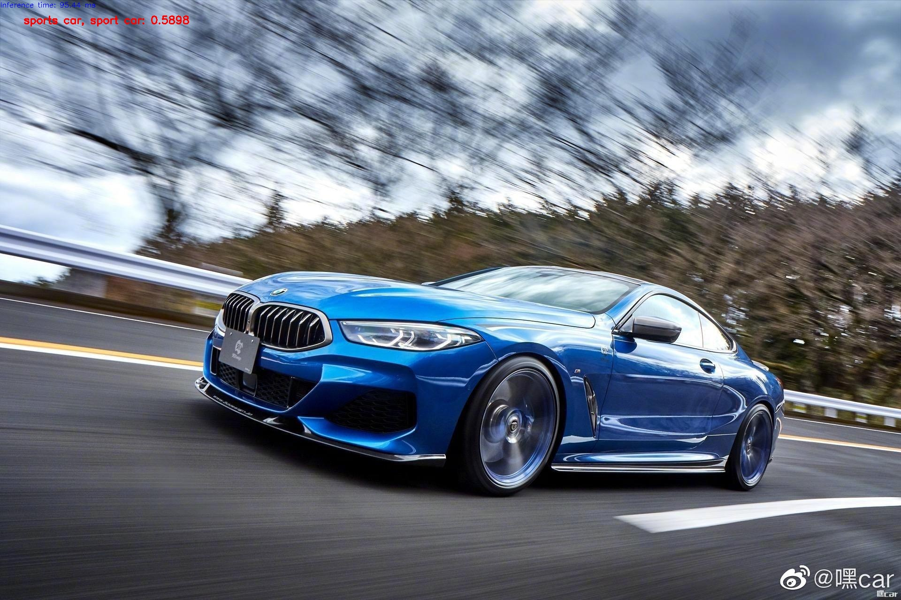

## OpenCV DNN单张与多张图像的推断

OpenCV DNN中支持单张图像推断，同时还支持分批次方式的图像推断，对应的两个相关API分别为blobFromImage与blobFromImages，它们的返回对象都是一个四维的Mat对象-按照顺序分别为NCHW 其组织方式详解如下：

N --> 表示多张图像

C --> 表示接受输入图像的通道数目

H --> 表示接受输入图像的高度

W --> 表示接受输入图像的宽度
```python
cv2.dnn.blobFromImage(
    image,
    scalefactor = 1.0,
    size = Size(),
    mean = Scalar(),
    swapRB = false,
    crop = false,
    ddepth = CV_32F
)
```
```python
cv2.dnn.blobFromImages(
	images,
	scalefactor = 1.0,
	size = Size(),
	mean = Scalar(),
	swapRB = false,
	crop = false,
	ddepth = CV_32F 
)
```

参数解释:

- Images表示多张图像,image表示单张图像
- Scalefactor表示放缩
- Size表示图像大小
- Mean表示均值
- swapRB是否交换通道
- crop是否剪切
- ddepth 输出的类型，默认是浮点数格式


输出：


