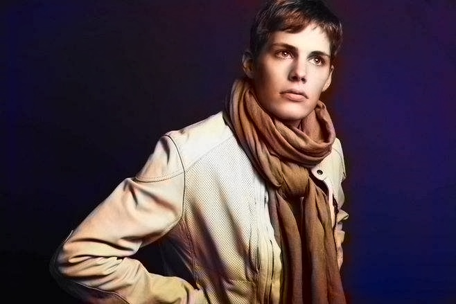
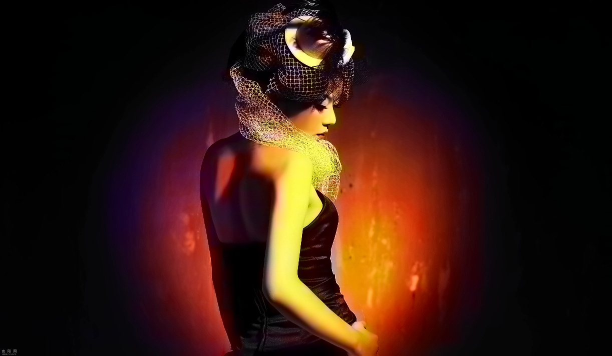

## OpenCV DNN 图像颜色化模型使用 

OpenCV DNN在4.0还支持灰度图像的彩色化模型，是根据2016年ECCV的论文而来，基于卷积神经网络模型，通过对Lab色彩空间进行量化分割，映射到最终的CNN输出结果，最后转换为RGB彩色图像。

相关论文详见：

Arxiv: [https://arxiv.org/pdf/1603.08511.pdf](https://arxiv.org/pdf/1603.08511.pdf)

OpenCV DNN使用该模型时候，除了正常的Caffe模型与配置文件之外，还需要一个Lab的量化表。

原图：

Colorization：

原图：

Colorization：

